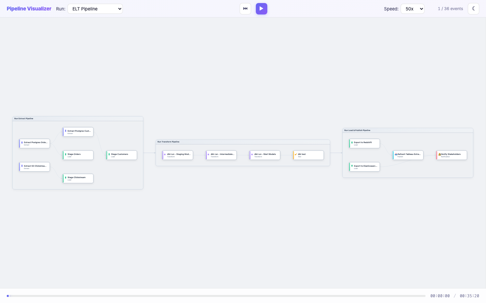

# Pipeline Visualizer

A canvas-based visualization library for rendering pipeline DAGs from OpenMetadata and OpenLineage data. Built with TypeScript, Canvas 2D, and WebGL — no frameworks.




## Features

- **Interactive DAG rendering** — nodes, edges, sub-pipeline groups with expand/collapse
- **Event simulation** — playback OpenLineage events with play/pause, speed control, seek, and timeline scrubbing
- **WebGL particle effects** — edge trails, completion bursts, failure flashes, ambient glow
- **Detail panel** — task info, timing, retry history, error stack traces, SQL display
- **Dataset preview & download** — tabular preview with CSV/JSON export via a fake data API
- **Raw JSON inspector** — syntax-highlighted view of original pipeline and event JSON
- **Light/dark theme** — glassmorphism, gradients, automatic system preference detection
- **Custom layout engine** — topological layering with barycenter ordering (no dagre dependency)

## Quick Start

```bash
npm install
make start
```

This compiles TypeScript, starts the app server on **http://localhost:8000** and the data API on **http://localhost:8001**.

Then open **http://localhost:8000** in your browser.

## Commands

| Command | Description |
|---------|-------------|
| `make start` | Compile + start app (8000) and data API (8001) |
| `make stop` | Stop all servers |
| `make restart` | Stop then start |
| `make status` | Check if servers are running |
| `make dev` | Watch mode — recompile on file changes |
| `make build` | Bundle library to `dist/` |
| `make check` | Type-check (no emit) |
| `make test` | Run 104 tests headlessly via Playwright |
| `make test-browser` | Open test page in browser |
| `make open` | Open app in default browser |
| `make clean` | Stop servers, remove pid files |

## Project Structure

```
src/
  data/
    pipeline-loader.ts    Fetch & normalize pipeline JSON
    event-store.ts        Fetch & normalize OpenLineage events
    dag-builder.ts        DagNode, DagEdge, DagModel graph
    event-correlator.ts   Map events to nodes, track status
    runs.ts               Run definitions (pipeline + event file paths)
  render/
    canvas-renderer.ts    2D canvas rendering (nodes, edges, groups)
    webgl-overlay.ts      WebGL particle system (glow, ripples, trails)
    camera.ts             Viewport, zoom, pan
  layout/
    dagre-layout.ts       Topological sort + barycenter node ordering
    group-layout.ts       Sub-pipeline group containment
  ui/
    detail-panel.ts       Right panel: info, datasets, JSON inspector
    interaction.ts        Mouse/touch: click, hover, pan, zoom
    controls.ts           Toolbar: run picker, theme toggle
  harness/
    simulation-source.ts  Event playback data source
    clock.ts              Simulation clock with speed control
    event-streamer.ts     Time-based event delivery
    timeline.ts           Playback scrubber UI
  util/
    color.ts              Theme-aware color palettes
    geometry.ts           Bezier curves, rounded rects, hit testing
    format.ts             Duration, bytes, row count formatting
  pipeline-visualizer.ts  Main class: owns rendering, UI, interaction
  types.ts                Shared domain types
  index.ts                Library entry point

api/
  data_server.py          Fake data API (preview, download CSV/JSON)

examples/
  pipelines/              Sample OpenMetadata pipeline JSON (19 files)
  events/                 Sample OpenLineage event JSON by scenario

tests/
  test-*.ts               8 test suites, 104 tests total
  run_tests.js            Playwright headless runner
```

## Data Flow

```
Pipeline JSON files          OpenLineage event JSON files
        |                              |
  pipeline-loader.ts             event-store.ts
        |                              |
        +-------> SimulationSource <---+
                       |
                 dag-builder.ts  (graph structure)
                       |
                 dagre-layout.ts (node positioning)
                       |
              +--------+--------+
              |                 |
       CanvasRenderer     WebGLOverlay
       (nodes, edges)    (particles, glow)
              |                 |
              +--------+--------+
                       |
               PipelineVisualizer
                       |
                    Browser
```

## Example Runs

The app ships with 8 sample scenarios:

| Run | Description |
|-----|-------------|
| ELT Pipeline | 3-stage orchestrator with extract, transform, load sub-pipelines |
| ML Training | Feature engineering + model training with retry on failure |
| Failed Pipeline | Pipeline that encounters errors mid-execution |
| Order Processing | E-commerce order flow with payment and fulfillment |
| Media Encoding | Video transcoding pipeline |
| Checkout Flow | Multi-step checkout with inventory and payment |
| Batch Processing | Bulk data processing pipeline |
| Dynamic Routing | Config-driven routing — sub-pipeline discovered at runtime via OpenLineage events |

## Tech Stack

- **TypeScript** (strict, ES2022) — runtime deps: AJV + ajv-formats for schema validation
- **Canvas 2D** — node/edge rendering with theme-aware colors
- **WebGL** — point sprite particle system with custom shaders
- **esbuild** — fast transpilation and bundling
- **Playwright** — headless browser testing
- **Python 3** (stdlib only) — static file server + fake data API

## Sub-Pipeline Discovery

The system resolves sub-pipelines in two modes:

- **Static**: `buildDag()` matches SubPipeline task names to loaded pipeline FQNs at load time. If a task with `taskType: "SubPipeline"` has a `name` that matches another pipeline's `fqn`, its children are built immediately.

- **Dynamic**: When a SubPipeline task name doesn't match any loaded pipeline, the system waits for OpenLineage events. A child pipeline's `parent` run facet (containing `job.name: "parent_pipeline.task_name"`) links it to the unbound SubPipeline node. The candidate pipeline is then grafted into the DAG at runtime, triggering a relayout.

Candidate pipelines are loaded alongside the parent but remain dormant until events reveal which one ran. The "Dynamic Routing" example demonstrates this: three pipelines are loaded, but only the `batch_processor_pipeline` is grafted in when its START event carries a parent facet pointing to the `__dynamic_processor__` placeholder task.

## Custom Data Sources

The visualizer is decoupled from any specific data backend through the `DataSource` base class. You extend it to connect to your own APIs, WebSocket feeds, or static files.

### The DataSource contract

```typescript
import { DataSource } from 'pipeline-visualizer';

class DataSource {
  // Which UI controls this source supports (e.g., run picker dropdown)
  get capabilities(): Capabilities;

  // Available runs for the picker: { key: { label, pipelines, events } }
  get runs(): Record<string, RunDefinition>;

  // Load data for a run key. Build and return a DagModel.
  async load(config: string): Promise<DagModel | null>;

  // Called every requestAnimationFrame. Drive your clock/streaming here.
  tick(rafTime: number): void;

  // Current frame state, read by the renderer each frame.
  get frameState(): FrameState; // { currentTime: number }

  // Register callback: fires when a node's status changes.
  onNodeEvent(fn: (nodeId: string, event: PipelineEvent) => void): void;

  // Cleanup (close connections, clear timers).
  dispose(): void;
}
```

### Building a DagModel

Your `load()` method must return a `DagModel` — the graph the renderer draws. You construct it from `Pipeline` objects using the built-in `buildDag()`, or build one manually.

**Option A: Use the built-in builder with Pipeline objects**

```typescript
import { buildDag } from 'pipeline-visualizer';

async load(runKey: string): Promise<DagModel | null> {
  const pipelines: Pipeline[] = await this.fetchPipelines(runKey);
  return buildDag(pipelines);
}
```

Each `Pipeline` has this shape:

```typescript
interface Pipeline {
  id: string;
  name: string;           // unique key, used for event correlation
  displayName: string;
  fqn: string;            // fully qualified name
  description: string;
  scheduleInterval: string | null;
  concurrency: number;
  tags: string[];
  tasks: Task[];
}

interface Task {
  name: string;           // unique within the pipeline
  displayName: string;
  fqn: string;
  description: string;
  taskType: string;       // e.g., 'Extract', 'Transform', 'SubPipeline'
  taskSQL: string | null;
  downstreamTasks: string[]; // names of tasks this feeds into
}
```

`buildDag()` handles hierarchy (tasks with `taskType: 'SubPipeline'` whose `name` matches another pipeline's `fqn` become expandable groups), edge creation from `downstreamTasks`, and root pipeline detection.

**Option B: Build the DagModel manually**

```typescript
import { DagModel, DagNode, DagEdge } from 'pipeline-visualizer';

async load(config: string): Promise<DagModel | null> {
  const model = new DagModel();
  model.rootPipelineName = 'my_pipeline';

  const nodeA = new DagNode('my_pipeline::step_a', {
    displayName: 'Step A',
    taskType: 'Extract',
    pipelineName: 'my_pipeline',
    description: 'Extracts data from source',
  });

  const nodeB = new DagNode('my_pipeline::step_b', {
    displayName: 'Step B',
    taskType: 'Transform',
    pipelineName: 'my_pipeline',
  });

  model.nodes.set(nodeA.id, nodeA);
  model.nodes.set(nodeB.id, nodeB);

  const edge = new DagEdge('e0', nodeA.id, nodeB.id);
  model.edges.set(edge.id, edge);
  nodeA.edges.push(edge.id);
  nodeB.inEdges.push(edge.id);

  model.rootNodes.push(nodeA.id); // nodes with no incoming edges

  return model;
}
```

Node IDs follow the convention `pipelineName::taskName`. This is how the `EventCorrelator` maps events to nodes.

### Delivering events

Events drive node status changes and visual effects (particles, ripples, glow). You deliver them by calling the registered `onNodeEvent` callbacks.

**Using EventCorrelator (recommended)**

The `EventCorrelator` maps `PipelineEvent`s to the correct `DagNode` by matching `pipelineName` + `taskName`, updates node status/timing/datasets, and fires the callbacks for you.

```typescript
import { EventCorrelator } from 'pipeline-visualizer';

async load(runKey: string): Promise<DagModel | null> {
  const model = buildDag(pipelines);
  this.correlator = new EventCorrelator(model);

  // Wire through: correlator fires → your listeners fire
  this.correlator.onChange((nodeId, event) => {
    for (const fn of this._listeners) fn(nodeId, event);
  });

  return model;
}

// Then later, when events arrive (polling, WebSocket, etc.):
this.correlator.applyEvent(event);
```

Each `PipelineEvent` looks like:

```typescript
interface PipelineEvent {
  timestamp: number;              // epoch ms
  eventTime: string;              // ISO 8601
  eventType: 'START' | 'COMPLETE' | 'FAIL';
  runId: string;
  jobName: string;                // 'pipeline.task' or just 'pipeline'
  jobNamespace: string;
  pipelineName: string;           // must match Pipeline.name
  taskName: string | null;        // must match Task.name (null = pipeline-level)
  parentRunId: string | null;
  parentJobName: string | null;
  jobType: string | null;
  error: EventError | null;
  sql: string | null;
  inputs: Dataset[];
  outputs: Dataset[];
}
```

The correlator handles: status transitions (`pending` → `running` → `complete`/`failed`), retry detection (START after FAIL saves previous attempt), dataset merging, edge status propagation, and parent sub-pipeline status rollup.

**Manual status updates**

If you don't use OpenLineage event format, update nodes directly:

```typescript
const node = model.getNode('my_pipeline::step_a');
node.status = 'running';
node.startTime = Date.now();

// Fire the callback so the renderer shows visual effects
for (const fn of this._listeners) fn(node.id, myEvent);
```

### The tick loop

`tick(rafTime)` is called every animation frame. Use it to drive a clock or poll for new data:

```typescript
tick(rafTime: number): void {
  // Example: deliver queued events up to current wall time
  while (this.queue.length && this.queue[0].timestamp <= Date.now()) {
    this.correlator.applyEvent(this.queue.shift()!);
  }
}

get frameState(): FrameState {
  return { currentTime: Date.now() };
}
```

### Full example: WebSocket source

```typescript
import { DataSource } from 'pipeline-visualizer';
import { buildDag } from 'pipeline-visualizer';
import { EventCorrelator } from 'pipeline-visualizer';

class LiveSource extends DataSource {
  ws: WebSocket | null = null;
  correlator: EventCorrelator | null = null;
  _listeners: ((nodeId: string, event: PipelineEvent) => void)[] = [];

  get capabilities() { return { runPicker: false }; }

  async load(config: string): Promise<DagModel | null> {
    // Fetch pipeline definitions from your API
    const res = await fetch(`/api/pipelines/${config}`);
    const pipelines: Pipeline[] = await res.json();
    const model = buildDag(pipelines);

    this.correlator = new EventCorrelator(model);
    this.correlator.onChange((nodeId, event) => {
      for (const fn of this._listeners) fn(nodeId, event);
    });

    // Stream live events via WebSocket
    this.ws = new WebSocket(`ws://localhost:9000/events/${config}`);
    this.ws.onmessage = (msg) => {
      const event: PipelineEvent = JSON.parse(msg.data);
      this.correlator!.applyEvent(event);
    };

    return model;
  }

  tick(_rafTime: number): void {} // events arrive via WebSocket

  get frameState() { return { currentTime: Date.now() }; }

  onNodeEvent(fn: (nodeId: string, event: PipelineEvent) => void): void {
    this._listeners.push(fn);
  }

  dispose(): void {
    this.ws?.close();
    this._listeners = [];
  }
}

// Wire it up
const viz = new PipelineVisualizer(container, new LiveSource());
await viz.loadRun('production-pipeline-id');
```

### Full example: Static/snapshot source

```typescript
class SnapshotSource extends DataSource {
  _listeners: ((nodeId: string, event: PipelineEvent) => void)[] = [];

  get capabilities() { return { runPicker: false }; }

  async load(config: string): Promise<DagModel | null> {
    // Fetch a completed pipeline run snapshot
    const res = await fetch(`/api/runs/${config}`);
    const { pipelines, events } = await res.json();
    const model = buildDag(pipelines);

    // Apply all events immediately (no playback)
    const correlator = new EventCorrelator(model);
    correlator.onChange((nodeId, event) => {
      for (const fn of this._listeners) fn(nodeId, event);
    });
    for (const event of events) {
      correlator.applyEvent(event);
    }

    return model;
  }

  tick(_rafTime: number): void {}
  get frameState() { return { currentTime: Date.now() }; }
  onNodeEvent(fn: (nid: string, e: PipelineEvent) => void) { this._listeners.push(fn); }
  dispose(): void { this._listeners = []; }
}
```

### Reference: SimulationSource

The built-in `SimulationSource` (in `src/harness/simulation-source.ts`) is a full working example. It adds a simulation clock with play/pause/seek/speed control and time-based event delivery via `EventStreamer`. Study it for patterns around playback UI integration.

## Testing

```bash
# Headless (requires Playwright)
make test

# In browser
make test-browser
```

Tests cover DAG construction, event correlation, layout algorithms, hit testing, interaction handling, event streaming, and detail panel rendering.
